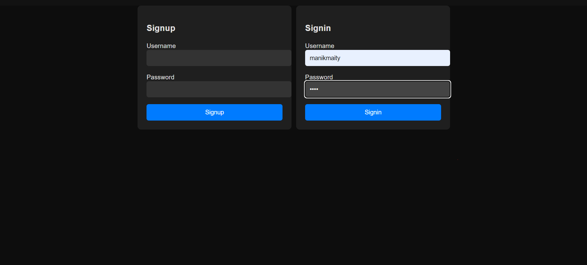
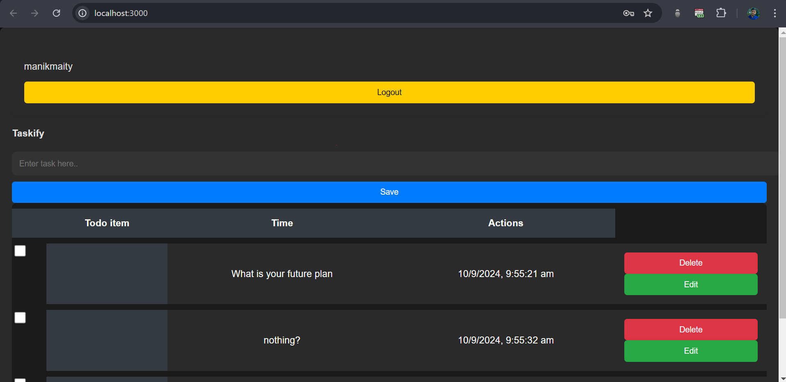

# Taskify

A simple task management application with a Node.js, Express and JS frontend with authentication.

**Features**
------------

*   Create, read, update, and delete tasks
*   Mark tasks as completed
*   Used Json Database to store tasks
*   Created Express API to manage tasks
*   Signup, signin and logout functionality
*   Authentication.
*   Used json file to store user data

**Preview**
------------
- Home Page 

- Signup & Login Page

**Quick Start**
---------------

### Backend

1.  Navigate to the `backend` directory.
2.  Install the dependencies with `npm install`.
3.  Start the server with `npm run dev`.

### Frontend

1.  Navigate to the `frontend` directory.
3.  Start the application with `npx serve`.

**Technology Stack**
--------------------

*   **Backend:** Node.js, Express, JWT
*   **Frontend:** HTML, CSS, JS, Axios

**Author**
------

Manik Maity